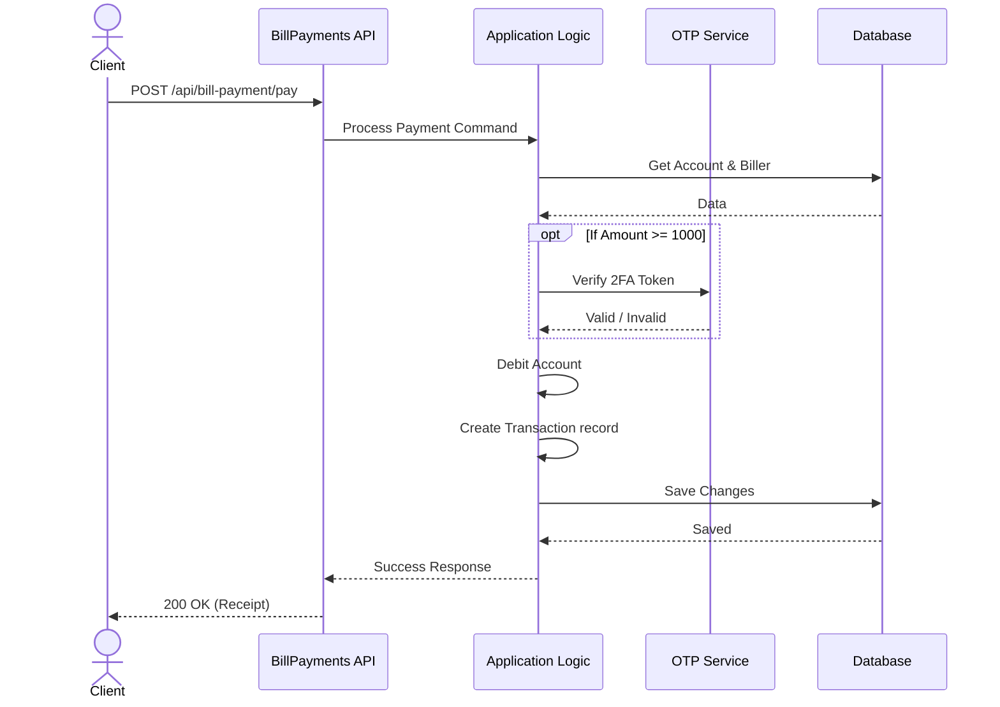

```mermaid
sequenceDiagram
    actor Client
    participant API as BillPayments API
    participant App as Application Logic
    participant OTP as OTP Service
    participant DB as Database

    Client->>API: POST /api/bill-payment/pay
    API->>App: Process Payment Command
    
    App->>DB: Get Account & Biller
    DB-->>App: Data
    
    opt If Amount >= 1000
        App->>OTP: Verify 2FA Token
        OTP-->>App: Valid / Invalid
    end

    App->>App: Debit Account
    App->>App: Create Transaction record
    
    App->>DB: Save Changes
    DB-->>App: Saved
    
    App-->>API: Success Response
    API-->>Client: 200 OK (Receipt)
```
