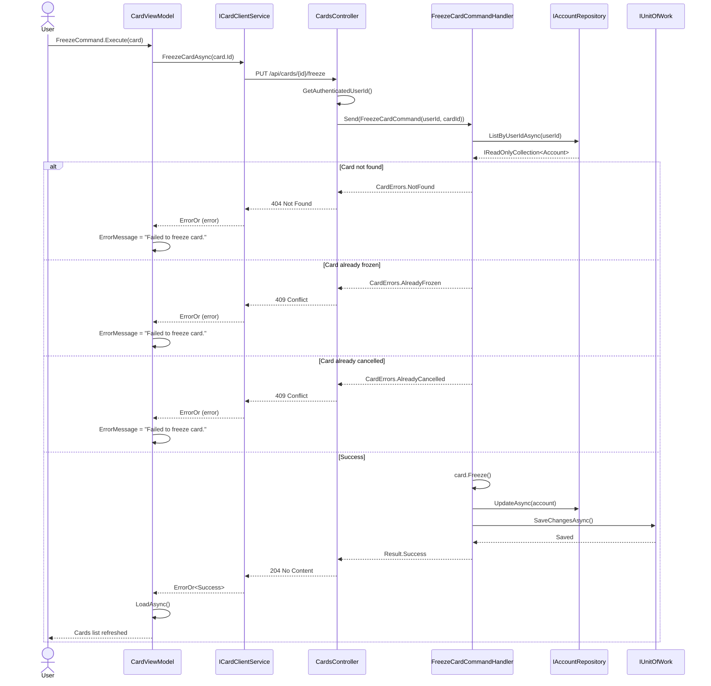

```mermaid
sequenceDiagram
    actor User
    participant VM as CardViewModel
    participant CS as ICardClientService
    participant API as CardsController
    participant MED as FreezeCardCommandHandler
    participant REPO as IAccountRepository
    participant UOW as IUnitOfWork

    User->>VM: FreezeCommand.Execute(card)
    VM->>CS: FreezeCardAsync(card.Id)
    CS->>API: PUT /api/cards/{id}/freeze

    API->>API: GetAuthenticatedUserId()
    API->>MED: Send(FreezeCardCommand(userId, cardId))

    MED->>REPO: ListByUserIdAsync(userId)
    REPO-->>MED: IReadOnlyCollection<Account>

    alt Card not found
        MED-->>API: CardErrors.NotFound
        API-->>CS: 404 Not Found
        CS-->>VM: ErrorOr (error)
        VM->>VM: ErrorMessage = "Failed to freeze card."
    else Card already frozen
        MED-->>API: CardErrors.AlreadyFrozen
        API-->>CS: 409 Conflict
        CS-->>VM: ErrorOr (error)
        VM->>VM: ErrorMessage = "Failed to freeze card."
    else Card already cancelled
        MED-->>API: CardErrors.AlreadyCancelled
        API-->>CS: 409 Conflict
        CS-->>VM: ErrorOr (error)
        VM->>VM: ErrorMessage = "Failed to freeze card."
    else Success
        MED->>MED: card.Freeze()
        MED->>REPO: UpdateAsync(account)
        MED->>UOW: SaveChangesAsync()
        UOW-->>MED: Saved
        MED-->>API: Result.Success
        API-->>CS: 204 No Content
        CS-->>VM: ErrorOr<Success>
        VM->>VM: LoadAsync()
        VM-->>User: Cards list refreshed
    end
```
